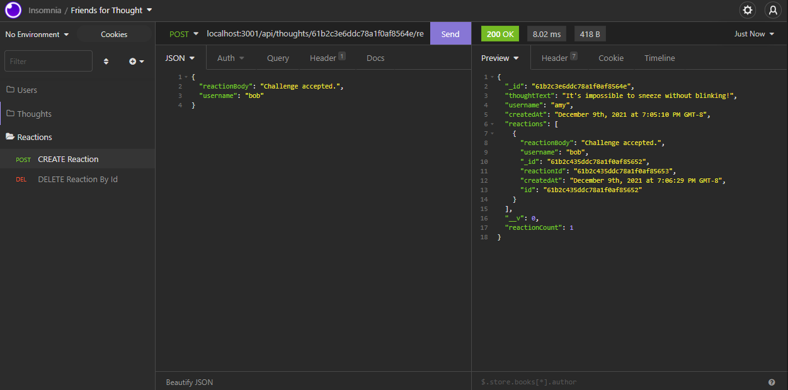

# Friends For Thought


[](https://choosealicense.com/licenses/mit/)

## Description
A social network API that uses a NoSQL (MongoDB) database in order to handle large amounts of unstructured data. Users can be created, post thoughts, add friends, and react to other users' thoughts.

## Table of Contents
* [Demo](#demo)
* [Installation](#installation)
* [Usage](#usage)
* [Validation](#validation)
* [License](#license)
* [Questions](#questions)

## Demo
[Click here](https://the-tech-blog-24601.herokuapp.com/) to watch a demo of the application.

## Installation
To install the app on your machine:

1. Install [Node.js](https://nodejs.org/en/) and [MongoDB](https://www.mongodb.com/) if you haven't already.
2. Clone this repository onto your computer.
3. Navigate to the root of this repository on the command line.
4. Run `npm install` on the command line.

## Usage
1. Install [Insomnia](https://insomnia.rest/download) if you haven't already.
2. Navigate to the root of this repository on the command line.
3. Run `npm start` on the command line to start the application.
4. Open Insomnia and use the following routes to perform CRUD operations:

    ### Users

    

    * `/api/users`
        - GET All Users
        - POST New User
            ```json
            // example user data
            {
                "username": "john",
                "email": "john@email.com"
            }
            ```
    * `/api/users/:id`
        - GET User By Id
        - PUT Update User By Id
        - DELETE User By Id

    * `/api/users/:userId/friends/:friendId`
        - POST New Friend
        - DELETE Friend

    ### Thoughts

    

    * `/api/thoughts`
        - GET All Thoughts
        - POST New Thought
            ```json
            // example thought data
            {
                "thoughtText": "Here's a thought...",
                "username": "john"
            }
            ```
    * `/api/thoughts/:id`
        - GET Thought By Id
        - PUT Update Thought By Id
        - DELETE Thought By Id

    ### Reactions

    

    * `/api/thoughts/:thoughtId/reactions`
        - POST New Reaction to a Thought
            ```json
            // example reaction data
            {
                "reactionBody": "I agree with this!",
                "username": "sarah"
            }
            ```
    
    * `/api/thoughts/:thoughtId/reactions/:reactionId`
        - DELETE Reaction by Thought Id and Reaction Id


## Validation
When posting new users, thoughts, and reactions, the app validates the JSON input before saving it to the database.

- Usernames must be unique strings and are required in order to create a new user, thought, or reaction.
- Emails must be unique strings that match the regex `/^([a-z0-9_\.-]+)@([\da-z\.-]+)\.([a-z\.]{2,6})$/`.
- `thoughtText` and `reactionBody` are required in order to create a new thought or reaction.

## License
Licensed under the [MIT](https://choosealicense.com/licenses/mit/) license.

## Questions
- [GitHub](https://github.com/kg-phantom)